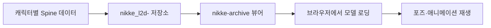

# NIKKE Live2D Assets

`nikke-archive`의 Spine 기반 Live2D 뷰어에서 사용하는 캐릭터 모델과 관련 리소스를 관리하는 에셋 저장소입니다.

이 저장소는 웹 애플리케이션 소스 코드보다 캐릭터별 Spine 데이터와 텍스처 파일 관리에 초점을 둡니다.

## 연결 프로젝트

- 웹 애플리케이션: https://github.com/yunjae305/nikke-archive
- 배포 사이트: https://nikkearc.vercel.app

## 저장 데이터

캐릭터별로 다음과 같은 리소스를 관리합니다.

- Spine skeleton 데이터
- atlas 파일
- texture 이미지
- 기본 포즈 리소스
- 조준·엄폐 등 지원 포즈 리소스
- 캐릭터별 추가 애니메이션 데이터

## 사용 흐름

## 저장소 역할

| 저장소 | 역할 |
|---|---|
| [`nikke_l2d-`](https://github.com/yunjae305/nikke_l2d-) | Spine 모델, atlas, texture 등 대용량 에셋 관리 |
| [`nikke-archive`](https://github.com/yunjae305/nikke-archive) | 캐릭터 검색, 육성 정보, 계산기, Live2D 뷰어 UI |

## 관리 기준

- 캐릭터별 파일 구조를 가능한 한 일관되게 유지합니다.
- 누락된 texture 또는 pose 파일을 확인해 순차적으로 보완합니다.
- 뷰어에서 불러오는 경로와 실제 파일 경로가 일치하도록 관리합니다.
- 동일한 캐릭터의 리소스가 중복 저장되지 않도록 확인합니다.

## 대용량 파일 안내

이 저장소는 이미지와 모델 파일 비중이 높아 용량이 큽니다.

전체 저장소가 필요하지 않은 경우 Git clone 대신 필요한 파일만 내려받거나, 웹 애플리케이션인 `nikke-archive` 저장소를 먼저 확인하는 것을 권장합니다.

향후 용량이 더 증가할 경우 다음 방식으로 이전할 수 있습니다.

- Git LFS
- Object Storage
- CDN
- 릴리스 단위 압축 배포

## 유의사항

- 본 저장소는 비공식 팬 프로젝트의 리소스 관리 용도입니다.
- 게임명, 캐릭터, 이미지, 모델과 원본 에셋에 대한 권리는 각 권리자에게 있습니다.
- 저장된 리소스는 학습 및 비상업적 팬 프로젝트 용도로만 사용합니다.
